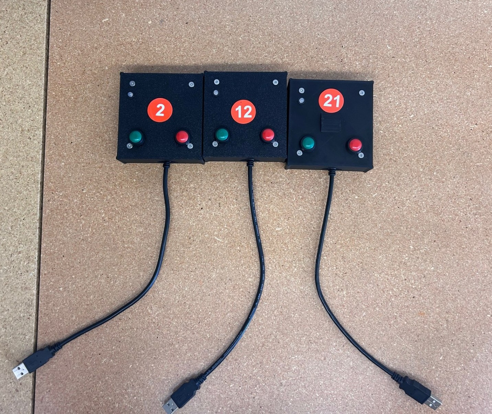
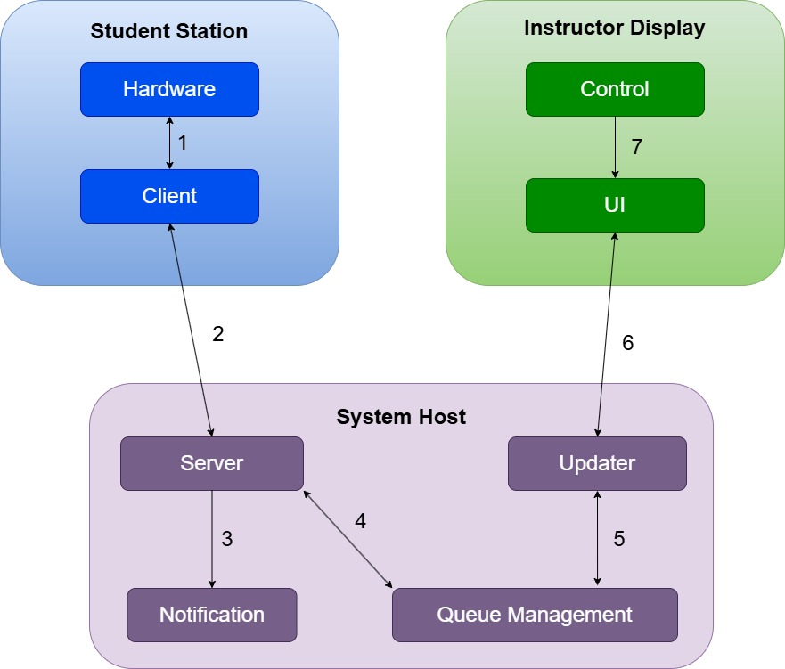
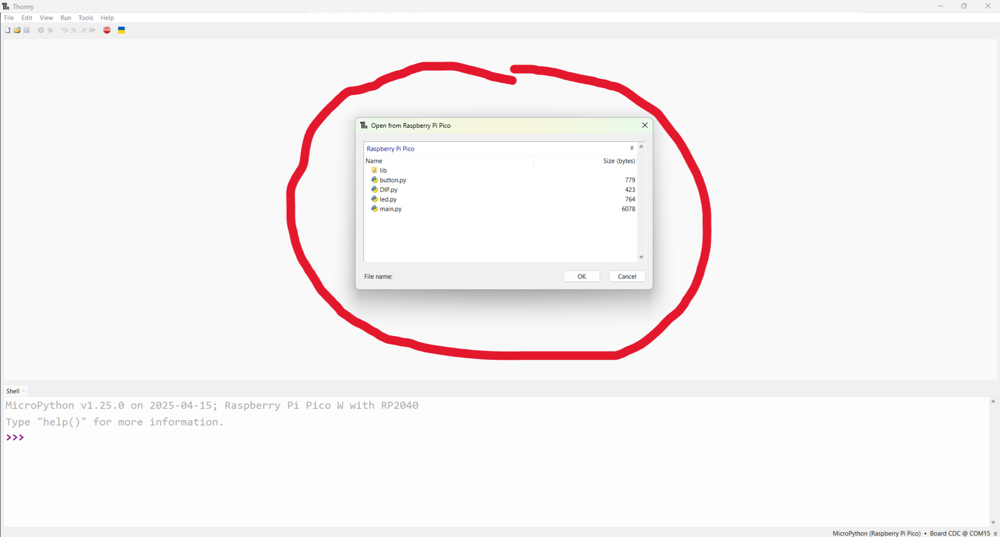
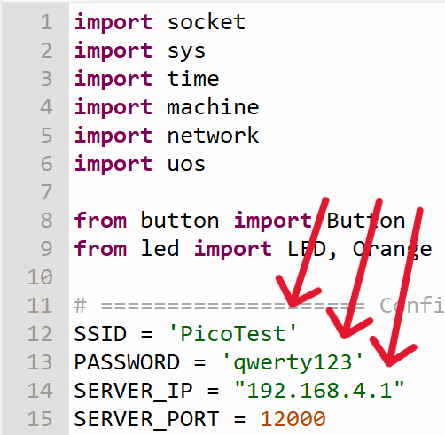
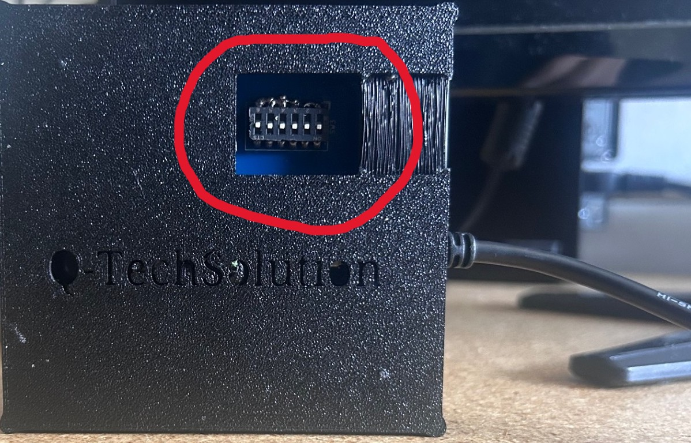

# Queue Management System
A system designed to assist teachers and teaching assistants in efficiently managing situations where multiple students raise their hands simultaneously.

---
## 📖 Description

The Queue System reduces student wait times and assists TAs in tracking and prioritizing student help requests.
Each student station (Raspberry Pi Pico W) is equipped with red/green buttons and an LED indicator; 
status updates are sent via UDP to a central host (Raspberry Pi 3) that maintains a live queue and displays it through a GUI.



---

## System Architecture

1. **Station Module (Client)**
   - Raspberry Pi Pico W with DIP-switch configured ID.
   - Red button = "Need Help" (red LED), Green button = "Check-Off" (green LED).
   - Sends `ID:<n>,status:<red|green|off>` messages via UDP to the Host.

2. **Host Module (Server)**
   - Raspberry Pi 3 with static IP (`192.168.1.22`).
   - UDP listener on port 12000 processes client updates.
   - `DeviceManager` handles queue state, priorities, and time stamps.
   - GUI (Tkinter + Pillow) displays a 6×5 grid of station boxes, color-coded by status.

   
---

## Features

- **UDP-based communication** with no handshake overhead.
- **DIP-switch** ID configuration on each station.
- **Real-time queue** display with auto sort.
- **Manual override**: TA can click boxes in the GUI to clear or reprioritize.
- **Adaptive UI**: Resizes boxes and fonts automatically on window resize.
- **Sound notifications** on new help requests.
- **Session persistence**: Device states stay the same until cleared.

---

## 📋 Parts List

### Host Module
- Raspberry Pi 3 (static IP)
- Case, HDMI cable, power supply, Keyboard+Mouse attached (bluetooth)

### Station Module (×30, +10 backup)
- Raspberry Pi Pico W
- Custom PCB
- Red & green push buttons
- Red/Green/Orange bi‑color LED
- USB power cable
- 3D‑printed enclosure + screws

---

## 🛠️ Prerequisites

- **Host**: Raspberry Pi OS with Python 3.1+ installed.
- **Tkinter** (usually bundled with Python on Raspbian).
- **Pillow**
- **pygame** for image and sound handling.

---

## 💾 Installation & Setup Server ONLY

### 1. Update & Install System Packages
```bash
sudo apt update
sudo apt install python3-pip
sudo apt install python3-tk # GUI display
pip3 install Pillow # Image Background handling
pip3 install pygame # For sound effect 
```
### 2. Configure Host
- **Static IP** This vary from router to router, but essentially go to your router setting, select
                the device you wish to set static IP, and have the router reserve that IP.
                Here more information on why this work:
                [https://www.gendronify.com/how-to-set-a-static-ip/]
                (scroll down to "How to Reserve Static IP in Router Settings")

- **Image/Sound** These can be changed from the folder found in: GUI_Server > sound.wav and bg.jpg

## 💾 Installation & Setup Client ONLY

### 1. Update & Install System Packages
- **NOTE** This is Pico-W only. Follow the instruction from the link:
            [https://projects.raspberrypi.org/en/projects/get-started-pico-w/1]

### 2. Configure Host
- **Folder** This repository has all the code for client, just click and drop the folder.



- **Edit** SSID, PASSWORD, and SERVER_IP as needed based on Wifi
           (You'll only have to do this once per devices, ONLY IF, you have config Static IP correctly)
   


- **Set** The DIP switch for each station from ID (1 - 30)


---

## ▶️ Running the System

### 1st. Run Server GUI (Raspberry Pi 3)

```bash
python3 main.py
```
   * You may also run as editor such as Thonny

### 2nd. Connect Pico Devices to Outlet
   * If all the code were added during the Installation process, it should run by itself.
   * You'll see the following:
      - 1. LED blinks Orange and stay solid orange indicating it is connecting to Wi-Fi
      - 2. If LED blinks Red, Pico Device failed to connect to Wi-Fi
      - 3. If LED blinks Green, Pico Device is connected to Wi-Fi and ready to use
      - 4. In both cases, the LED will turn off once it has indicated its current state of process.

### 3rd. Test Run
   * Watch the GUI display the correct queue based on student pressing button.
   * TA can now click the GUI to turn off LED or manually turn off from the student station.

---

## ✨Future Plans✨

*  There still much work ahead until the queue is at it's best performance. Integration of a setting GUI
   to change background image or sound effect would be nice. Also adding an indication of where the Queue start
   would be helpful, an Analytic dashboard would be amazing to check waiting time.

---

## DEMO Video
   [Watch the demo](assets/demo.mp4)
